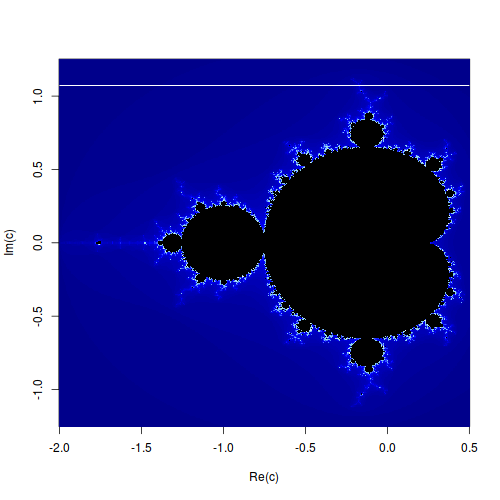

<!--
$theme: default
$size: A4
page_number: true
-->

# RcppによるC++プログラムの呼び出し
### 阪大京大遺伝統計交流会＠京大

岡田卓也
今年度: 初期研修医2年目@滋賀県立総合病院
来年度: D1@統計遺伝学教室

---
<!--footer: 阪大京大遺伝統計交流会＠京大-->

# ハンズオンの概要
<font size=4>

* C++とは
* C++の文法
* ビルドシステム
* オブジェクトモデル(メモリレイアウト)
* 並列化
  * マルチスレッドプログラム
    * OpenMP
    * pthread
    * std::thread
    * async/await
    * mutex/atomic
    * condition_variable
  * SIMD
  * GPGPU(CUDA, OpenCL)
* Rcppの使い方(岡田大瑚さん)
* パッケージの作り方(岡田大瑚さん)

</font>

---
# C++とは
* [C++ (Wikipedia)](https://ja.wikipedia.org/wiki/C%2B%2B)
* 低水準から高水準まで
* マルチパラダイム
  * 手続き型/関数型プログラミング
  * オブジェクト指向
  * ジェネリックプログラミング(テンプレート)

---
# C++とは
* 長所
  * 高速、型安全性、充実したライブラリ
* 短所
  * 文法が複雑
  * 「未定義動作」でもコンパイルが通ってしまう
  * コンパイルエラーが分かりづらい
  * ビルドシステムが標準化されていない
* RとC++の違い...?

---
# 文法
<font size=5>
  
```cpp
#include <iostream>
#include <string>
#include <boost/range/irange.hpp>

std::string fizzbuzz(int n)
{
  std::string ret;
  if (n%15 == 0) ret = "fizzbuzz";
  else if (n%3 == 0) ret = "fizz";
  else if (n%5 == 0) ret = "buzz";
  else ret = "";

  return ret;
}

int main(void);
{
  for (auto n: boost::irange(1,16))
    std::cout << fizzbuzz(n) << std::endl;

  return 0;
}
```
* Rとの共通点、相違点
</font>

---
# 文法
```cpp
struct Person {
  int age;
};

Person *person;
int person->age;
// (*person).age; と同じ意味

Person &person;
int person.age;
```
* Rのlistをイメージすると分かりやすいかも
  ``p <- list(age=3); p$age``

---
# 文法
```cpp
template <class T>
struct remove_const {
  typedef T type;
  // using type = T; と同じ意味
};

template <class T>
struct remove_const<const T> {
  typedef T type;
};

remove_const<const int>::type value = 3; // int
```

* [C++ reference](https://en.cppreference.com/w/)
  * [DevDocs](https://devdocs.io/), [Zeal](https://zealdocs.org)

---
# 文法
→ 別資料へ

---
# ビルドシステム
* C++は規格が先にあって、コンパイラは規格に準拠するように実装される
  * GCC, Clang, Visual C++, Intel C++ Compiler, etc.
  * [Wandbox](https://wandbox.org)を使えば、最新のコンパイラを利用できる
* コンパイラの使い方
  * ``clang++ prog.cc -Wall -Wextra -O2 -march=native``
    ``-I/opt/wandbox/boost-1.65.1/clang-head/include``
    ``-std=c++2a``
  * 最初は``clang++ prog.cpp``、``./a.out``だけで十分
  * コンパイラによってオプションは異なる
* Make, CMake, etc.

---
# ビルドシステム
* ありがちなこと: 拾い物のC++プログラムがコンパイルできない

# デモ
```sh
mkdir fairing && cd fairing
svn export \
  https://github.com/dgpdec/course/trunk/Fairing original
svn export \
  https://github.com/tak0kada/ShapeMove/trunk/src/Fairing \
  modified
```

* http://takuyaokada.hatenablog.com/entry/20160125/1453711369

---
# Mandelbrot Set Computation in R
* 参考文献
  * [My Christmas Gift: Mandelbrot Set Computation In Python](https://www.ibm.com/developerworks/community/blogs/jfp/entry/My_Christmas_Gift?lang=en)
  * [How To Quickly Compute The Mandelbrot Set In Python](https://www.ibm.com/developerworks/community/blogs/jfp/entry/How_To_Compute_Mandelbrodt_Set_Quickly?lang=en)

---
# マンデルブロ集合とは？


### 1. 定義
漸化式

$\begin{cases}z_{{n+1}}=z_{n}^{2}+c\\z_{0}=0\end{cases}$

で定義される複素数列$z_{n}\in \mathbb{C}$が$n\to\infty$の極限で無限大に発散しない複素数全体が作る集合を、マンデルブロ集合という(以下$\mathbb{M}$と表す)。

### 2. 性質
$\exists {n} \in \mathbb{N}, |z_{n}|>2 \to z_{n} \notin \mathbb{M}$

---
# 単純なRコード
<font size=5>

```r
mandelbrot_1 <- function(c, max.iter=128)
{
  z <- c
  for (rep in 1:max.iter)
  {
    if (Mod(z) > 2) return(list(z=z, k=rep-1))
    z <- z*z + c
  }
  return(list(z=z, k=max.iter))
}

mandelbrot_naive <- function(
  xmin=-2.0, xmax=0.5, ymin=-1.25, ymax=1.25, nx=500, ny=500, max.iter=128)
{
  X <- seq(xmin, xmax, length.out=nx)
  Y <- seq(ymin, ymax, length.out=ny)
  Z <- matrix(0.0, nrow=nx, ncol=ny)
  K <- matrix(0.0, nrow=nx, ncol=ny)
  for (i in 1:nx) for (j in 1:ny)
  {
    tmp <- mandelbrot_1(X[i] + 1i*Y[j], max.iter)
    Z[i, j] <- tmp$z
    K[i, j] <- tmp$k
  }
  return(list(X=X, Y=Y, Z=Z, K=K))
}
```

</font>

---
# 単純なRコード
<font size=5>

```r
xmin=-2.0; xmax=0.5; ymin=-1.25; ymax=1.25
nx=500; ny=500; max.iter=128

M <- mandelbrot_naive(xmin, xmax, ymin, ymax, nx, ny, max.iter)

mandelbrot_plot <- function(M)
{
  cols <- c(
    colorRampPalette(
      c("#00008b", "blue", "#87cefa", "#87ceeb", "#b0e0e6", "white"))(100), 
    "black")
  image(M$X, M$Y, M$K, col=cols, xlab="Re(c)", ylab="Im(c)")
}

png("~/hands-on-20190305/slide/mandelbrot_plot.png", width=nx, height=ny)
mandelbrot_plot(M)
dev.off()
```

</font>



---

# ベクトル化したRコード(1)
<font size=5>

```r
mandelbrot_vectorized_1 <- function(
  xmin=-2.0, xmax=0.5, ymin=-1.25, ymax=1.25,
  nx=500, ny=500, max.iter=128)
{
  X <- seq(xmin, xmax, length.out=nx)
  Y <- seq(ymin, ymax, length.out=ny)
  C <- outer(X, 1i*Y, FUN="+")
  Z <- C
  K <- matrix(0.0, nrow=nx, ncol=ny)
  
  for (rep in 1:max.iter)
  {
    index <- which(Mod(Z) <= 2)
    Z[index] <- Z[index]^2 + C[index]
    K[index] <- K[index] + 1
  }
  return(list(X=X, Y=Y, Z=Z, K=K))
}

# test
Mv1 <- mandelbrot_vectorized_1()
all.equal(Mv1$K == M$K, Mv1$Z == M$Z) # TRUE
```

参考: [https://www.r-bloggers.com/the-mandelbrot-set-in-r/](https://www.r-bloggers.com/the-mandelbrot-set-in-r/)

</font>

---
# doMC (doSNOW)、foreach
<font size=5>

```r
# doMC + foreach

library(foreach)
library(doMC)

registerDoMC(cores=as.integer(system("nproc", intern=TRUE))-1)

result <-
  foreach(i=1:10, .combine=c, .export=ls(envir=parent.frame())) %dopar% {
    myfunc()
  }
```
```r
# doSNOW + foreach (Windowsの人はこちらしか動かないかも)

library(foreach)
library(doSNOW)
library(parallel) # detectCores

cluster <- makeCluster(detectCores()-1, type="SOCK")
registerDoSNOW(cluster)

result <-
  foreach(i=1:10, .combine=c, .export=ls(envir=parent.frame())) %dopar% {
    myfunc()
  }

stopCluster(cluster)
```

</font>

---
# どのループを並列化するか???
<font size=5>

```r
mandelbrot_1 <- function(c, max.iter=128)
{
  z <- c
  for (rep in 1:max.iter)  # forループその1
  {
    if (Mod(z) > 2) return(list(z=z, k=rep-1))
    z <- z*z + c
  }
  return(list(z=z, k=max.iter))
}

mandelbrot_naive <- function(
  xmin=-2.0, xmax=0.5, ymin=-1.25, ymax=1.25, nx=500, ny=500, max.iter=128)
{
  X <- seq(xmin, xmax, length.out=nx)
  Y <- seq(ymin, ymax, length.out=ny)
  Z <- matrix(0.0, nrow=nx, ncol=ny)
  K <- matrix(0.0, nrow=nx, ncol=ny)
  for (i in 1:nx)  # forループその2
  for (j in 1:ny)  # forループその3
  {
    tmp <- mandelbrot_1(X[i] + 1i*Y[j], max.iter)
    Z[i, j] <- tmp$z
    K[i, j] <- tmp$k
  }
  return(list(X=X, Y=Y, Z=Z, K=K))
}
```

</font>

---
# ベクトル化したRコード(2)
<font size=5>

```r
mandelbrot_vectorized2 <- function(
  xmin=-2.0, xmax=0.5, ymin=-1.25, ymax=1.25, nx=500, ny=500, max.iter=128)
{
  X <- seq(xmin, xmax, length.out=nx)
  Y <- seq(ymin, ymax, length.out=ny)
  Z <- rep(0.0 + 0.0i, nx*ny)
  K <- rep(0.0, nx*ny)
  for (i in 1:(nx*ny))  # 2つのforループをまとめる
  {
    tmp <- mandelbrot_1(
      X[i%%nx + ifelse(i%%nx,0,nx)] + 1i*Y[i%/%nx + ifelse(i%%nx,1,0)],
      max.iter)
    Z[i] <- tmp$z
    K[i] <- tmp$k
  }
  return(
    list(X=X, Y=Y, Z=matrix(Z, nrow=nx, ncol=ny),
      K=matrix(K, nrow=nx, ncol=ny)))
}

# test
Mv2 <- mandelbrot_vectorized2()
all.equal(Mv2$K == M$K, Mv2$Z == M$Z) # TRUE
```

</font>

---
# doMC (doSNOW)、foreachを使った並列化
<font size=5>

```r
library(foreach)
library(doMC)
registerDoMC(cores=as.integer(system("nproc", intern=TRUE))-1)

mandelbrot_parallel <- function(
  xmin=-2.0, xmax=0.5, ymin=-1.25, ymax=1.25, nx=500, ny=500, max.iter=128)
{
  X <- seq(xmin, xmax, length.out=nx)
  Y <- seq(ymin, ymax, length.out=ny)
  tmp <- foreach(i=1:(nx*ny), .combine=cbind) %dopar%
  {
    mandelbrot_1(
      X[i%%nx + ifelse(i%%nx,0,nx)] + 1i*Y[i%/%nx + ifelse(i%%nx,1,0)],
      max.iter)
  }
  Z = as.vector(tmp[1,])
  K = as.vector(tmp[2,])
  return(
    list(X=X, Y=Y, Z=matrix(Z, nrow=nx, ncol=ny),
      K=matrix(K, nrow=nx, ncol=ny)))
}

# test
Mp <- mandelbrot_parallel()
all.equal(Mp$K == M$K, Mp$Z == M$Z) # TRUE
```

</font>

---
# ここまでの関数のパフォーマンス
<table>
<tr>
<td></td>
<td>R</td>
<td>ベクトル化(2次元)</td>
<td>ベクトル化(1次元)</td>
<td>並列化</td>
</tr>
<tr>
<td>時間</td>
<td>sec</td>
<td>sec</td>
<td>sec</td>
<td>sec</td>
</tr>
</table>

<font size=5>

```r
func <- c(mandelbrot_naive, mandelbrot_vectorized1,
  mandelbrot_vectorized2, mandelbrot_parallel)

for (f in func)
{
  time <- foreach(i=1:10, .combine=c) %do% {
    system.time(f())
  }
  print(mean(time))
}
```
</font>